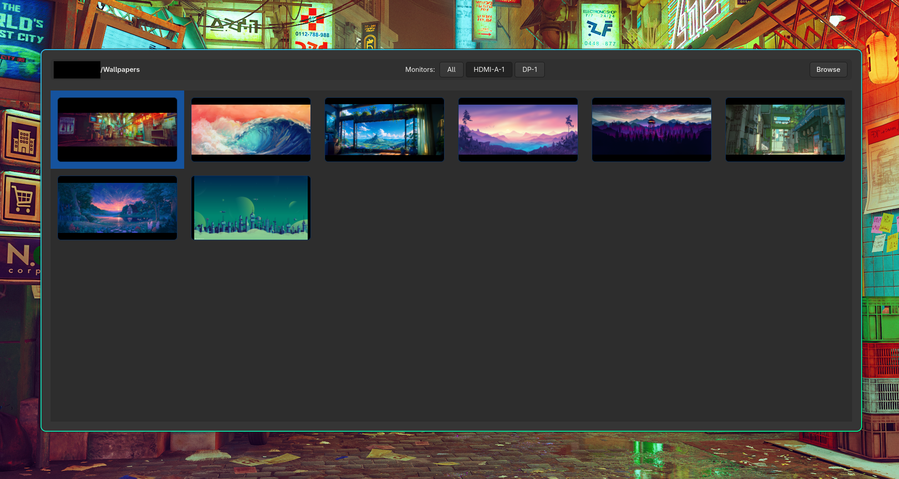

# Ultrapaper
Ultrapaper is a GUI for [hyprpaper](https://wiki.hypr.land/Hypr-Ecosystem/hyprpaper/), utilizing [hyprctl](https://wiki.hypr.land/Configuring/Using-hyprctl/) CLI tools to control hyprpaper.

## Features
- Multi-monitor control
- Auto update hyprpaper config file

## Installation
Ultrapaper is a GTK4 GUI for hyprpaper. You must be running Hyprland with hyprpaper enabled, and have `hyprctl` in your PATH.
### Dependencies
You need Go (≥1.23), GTK4 development files, GObject Introspection, and common graphics libs.
Debian/Ubuntu:
sudo apt update
sudo apt install -y build-essential pkg-config \
  libgtk-4-dev gobject-introspection libgirepository1.0-dev \
  libglib2.0-dev libcairo2-dev libsoup-3.0-dev \
  libpango1.0-dev libgdk-pixbuf-2.0-dev
Arch:
sudo pacman -S go gtk4 gobject-introspection glib2 cairo libsoup pango gdk-pixbuf
Fedora:
sudo dnf install golang gtk4-devel gobject-introspection-devel \
  glib2-devel cairo-devel libsoup3-devel pango-devel gdk-pixbuf2-devel
Nix (flake inputs example):
gtk4 gobject-introspection glib cairo libsoup pango gdk-pixbuf pkg-config
Verify:
pkg-config --cflags gtk4
pkg-config --cflags gobject-introspection-1.0
### Prebuilt Binary
1. Download the latest release from the Releases page.
2. Make it executable and put it somewhere in your PATH:
curl -L -o ultrapaper https://github.com/AhmedAlYousif/ultrapaper/releases/download/vX.Y.Z/ultrapaper-linux-x86_64_vX.Y.Z
chmod +x ultrapaper
mv ultrapaper ~/.local/bin/
Replace `vX.Y.Z` with the actual version.
### Build From Source
git clone https://github.com/AhmedAlYousif/ultrapaper.git
cd ultrapaper
CGO_ENABLED=1 go build -o ultrapaper
(Optional smaller binary):
CGO_ENABLED=1 go build -trimpath -ldflags="-s -w" -o ultrapaper
Run:
./ultrapaper
### Usage
- Ensure hyprpaper is configured/started in your Hyprland config.
- Launch Ultrapaper.
- Assign images per monitor; Ultrapaper writes the hyprpaper config automatically.
### Troubleshooting
Build fails with “Package gobject-introspection-1.0 not found”:
Install `gobject-introspection` and `libgirepository1.0-dev` (Debian/Ubuntu) or matching distro equivalents.
GTK headers not found:
Confirm `libgtk-4-dev` (Debian/Ubuntu) / `gtk4` (Arch) / `gtk4-devel` (Fedora) installed.
Nothing happens on wallpaper change:
Check `hyprctl monitors` output; ensure hyprpaper is running.
Segfault or display issues:
Run under Wayland/Hyprland (not X11). Confirm matching library versions and that `$WAYLAND_DISPLAY` is set.
### Notes
- Wayland only (Hyprland).
