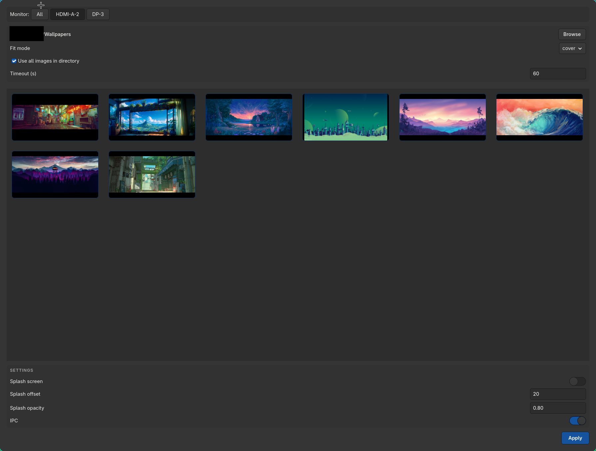

[](https://github.com/AhmedAlYousif/ultrapaper/releases)

# Ultrapaper
Ultrapaper is a GTK4 GUI for [hyprpaper](https://wiki.hypr.land/Hypr-Ecosystem/hyprpaper/), built with Rust. It uses [hyprctl](https://wiki.hypr.land/Configuring/Using-hyprctl/) to apply wallpapers live and writes the hyprpaper config automatically.



## Features
- Per-monitor wallpaper selection
- Fit mode control (contain, cover, tile, fill)
- Directory mode with configurable timeout
- Global settings: splash, splash offset, splash opacity, IPC
- Live wallpaper apply via hyprctl (no restart needed for path-only changes)
- Auto-updates hyprpaper config file

## Requirements
- Hyprland with hyprpaper running
- `hyprctl` in your PATH

## Installation

### Arch Linux
#### AUR Package (Recommended)
```bash
yay -S ultrapaper
```
```bash
paru -S ultrapaper
```

**Manual AUR installation:**
```bash
git clone https://aur.archlinux.org/ultrapaper.git
cd ultrapaper
makepkg -si
```

### Prebuilt Binary
Download the latest release from the [Releases page](https://github.com/AhmedAlYousif/ultrapaper/releases):
```bash
curl -L -o ultrapaper https://github.com/AhmedAlYousif/ultrapaper/releases/download/vX.Y.Z/ultrapaper-linux-x86_64_vX.Y.Z
chmod +x ultrapaper
mv ultrapaper ~/.local/bin/
```
Replace `vX.Y.Z` with the actual version.

### Build From Source
#### Dependencies
You need Rust (stable) and GTK4 development files.

##### Arch:
```bash
sudo pacman -S gtk4 gobject-introspection glib2 cairo pango gdk-pixbuf2
```

##### Debian/Ubuntu:
```bash
sudo apt install -y build-essential pkg-config \
    libgtk-4-dev gobject-introspection libgirepository1.0-dev \
    libglib2.0-dev libcairo2-dev libpango1.0-dev libgdk-pixbuf-2.0-dev
```

##### Fedora:
```bash
sudo dnf install gtk4-devel gobject-introspection-devel \
    glib2-devel cairo-devel pango-devel gdk-pixbuf2-devel
```

#### Build
```bash
git clone https://github.com/AhmedAlYousif/ultrapaper.git
cd ultrapaper
cargo build --release
./target/release/ultrapaper
```

## Usage
- Ensure hyprpaper is running in your Hyprland config.
- Launch Ultrapaper.
- Select a monitor, pick a wallpaper and fit mode, then click Apply.
- Changes that only affect the wallpaper path are applied live; other changes prompt a hyprpaper restart.

## Troubleshooting
**Build fails with missing pkg-config packages:**
Install the GTK4 dev libraries for your distro (see above).

**Nothing happens on wallpaper change:**
Check `hyprctl monitors` output and ensure hyprpaper is running.

**Segfault or display issues:**
Run under Wayland/Hyprland (not X11). Confirm `$WAYLAND_DISPLAY` is set.

## Notes
- Wayland only (Hyprland).
